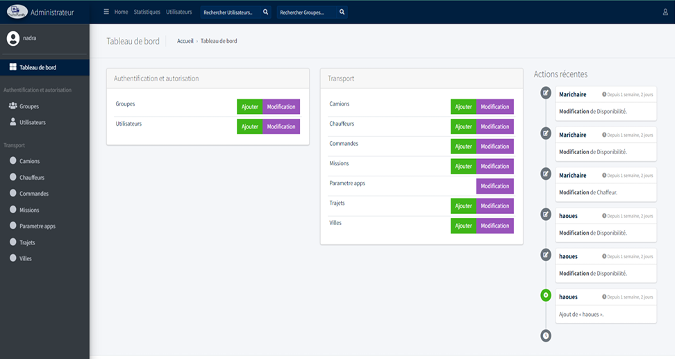

# 👋 Bonjour, je suis Mouloud Beldjoudi

🎓 Étudiant en **Data Science** (Collège La Cité) • 📍 Gatineau (QC), Canada  
💡 Intérêts : **Data Visualization**, **Machine Learning**, **Analyse de données**, **Optimisation**, **Cloud/GitHub**

---

## 🚀 À propos
Je construis des projets data **de bout en bout** : nettoyage → analyse → visualisation → interprétation → (déploiement/partage).  
Mon objectif : produire des résultats **clairs, utiles et orientés impact** (business / décision).

---

## 🧰 Compétences (Stack)
- **Langages** : Python, SQL, R  
- **Data / BI** : Power BI, Excel (Power Query), Data Storytelling, KPI  
- **ML** : régression, classification, évaluation (MAE/MSE, accuracy), overfitting  
- **Outils** : Git/GitHub, Jupyter, MySQL, MongoDB

---

## 🌐 Portfolio (site)
👉 https://Mouloud2498.github.io/

📄 [Télécharger mon CV](https://Mouloud2498.github.io/assets/CV_Final%20MB.pdf)

---

## ⭐ Projet phare — Optimisation des commandes logistiques (Affectation Commandes → Camions)

**Problème :** affecter les commandes aux camions de façon optimale pour réduire les coûts et améliorer la performance de livraison.  
**Approche :** nettoyage des données → définition des contraintes → modèle d’optimisation → analyse des gains.  
**Impact :** réduction des coûts, meilleure utilisation des camions, décisions plus rapides.

📌 Repo : https://github.com/Mouloud2498/Optomisatiom_Flux_Logistique_VF.git

### Aperçu

